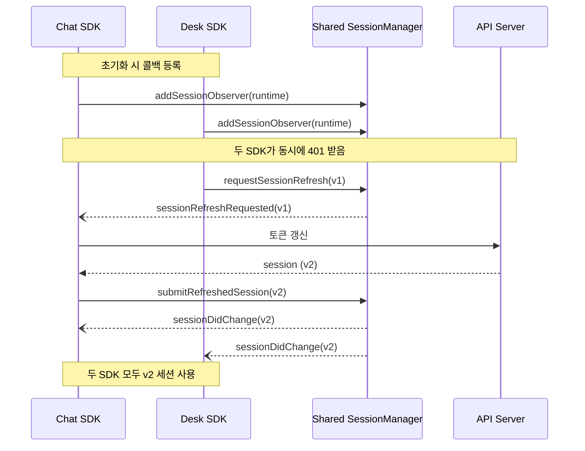
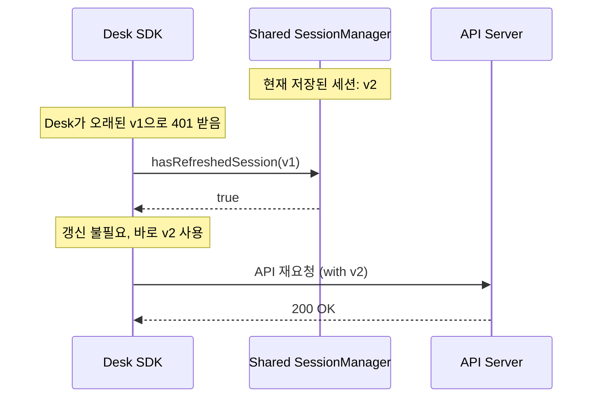
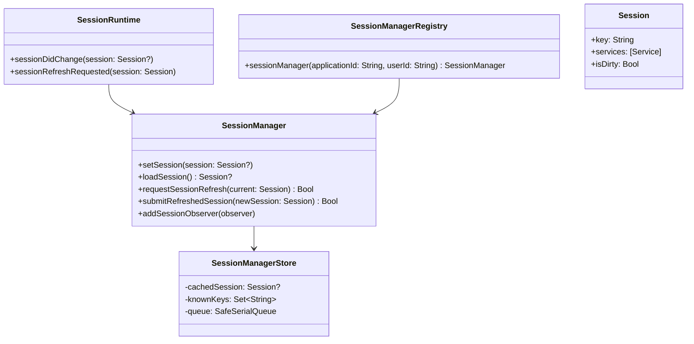
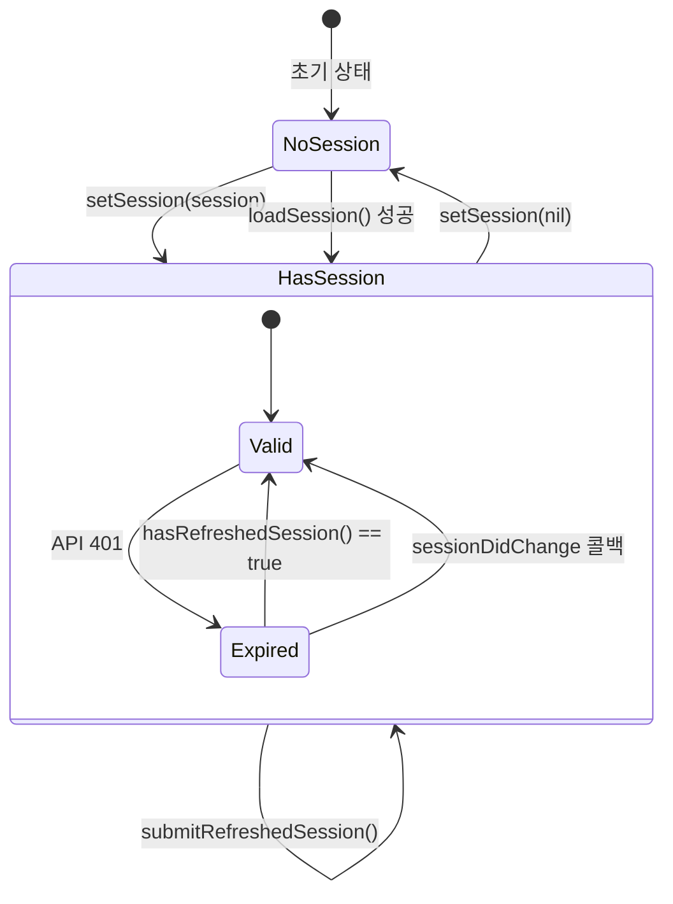

# SessionManager Specification

## 개요

공유 `SessionManager`는 여러 SDK 간 세션을 저장하고 조정하는 코어입니다.
세션 만료 시 한 `SessionRuntime`이 갱신한 세션을 다른 runtime들과 공유합니다.

---

## 메서드 스펙

### `requestSessionRefresh(for: Session) -> Bool`

| 항목          | 내용                                     |
| ------------- | ---------------------------------------- |
| **호출 시점** | API 응답이 401일 때                      |
| **파라미터**  | `current` - 현재 SDK가 보유한 세션       |
| **반환값**    | 갱신 가능한 observer가 있으면 `true`, 없으면 `false` |

**동작**:

```
for observer in observers where observer.canRefreshSession:
    observer.sessionRefreshRequested(for: current)
return observers.contains(where: \.canRefreshSession)
```

**호출자 후속 처리**:
| 반환값 | 처리 |
|--------|------|
| `true` | `sessionDidChange` 또는 `sessionRefreshFailed` 콜백 대기 |
| `false` | 즉시 refresh failure 처리 |

---

### `submitRefreshedSession(_ newSession: Session) -> Bool`

| 항목          | 내용                                       |
| ------------- | ------------------------------------------ |
| **호출 시점** | 토큰 갱신 API 응답 받았을 때               |
| **파라미터**  | `newSession` - 갱신 API로 받은 새 세션     |
| **반환값**    | `true` - 채택됨, `false` - 거부됨 (이미 사용된 키) |

**동작**:

```
if newSession.key in knownKeys:
    return false  // 이미 사용된 키 → 롤백 방지
else:
    knownKeys.insert(newSession.key)
    저장된 세션 = newSession
    onSessionChanged 콜백 호출
    return true
```

---

## 세션 식별 기준

```
새 세션 채택 여부  ⟺  newSession.key not in knownKeys
```

> **knownKeys**: 이미 사용된 세션 키를 추적하는 Set. 이전 키로의 롤백을 방지합니다.

---

## 콜백 규칙

### `onSessionChanged(handler: (Session?) -> Void)`

| 항목          | 내용                          |
| ------------- | ----------------------------- |
| **호출 시점** | SDK 초기화 시                 |
| **용도**      | 세션 변경 알림 수신 |

**콜백 발생 조건**:
| 트리거 | 콜백 호출 |
|--------|-----------|
| `setSession` 호출 | ✅ 호출 |
| `submitRefreshedSession`에서 새 세션 채택됨 | ✅ 호출 |
| `submitRefreshedSession`에서 기존 세션 유지됨 | ❌ 호출 안 함 |

---

## 시나리오

### 시나리오 1: 동시 401 발생



---

### 시나리오 2: 이미 갱신된 세션이 있는 경우



---

## 컴포넌트 구조



---

## 상태 다이어그램


